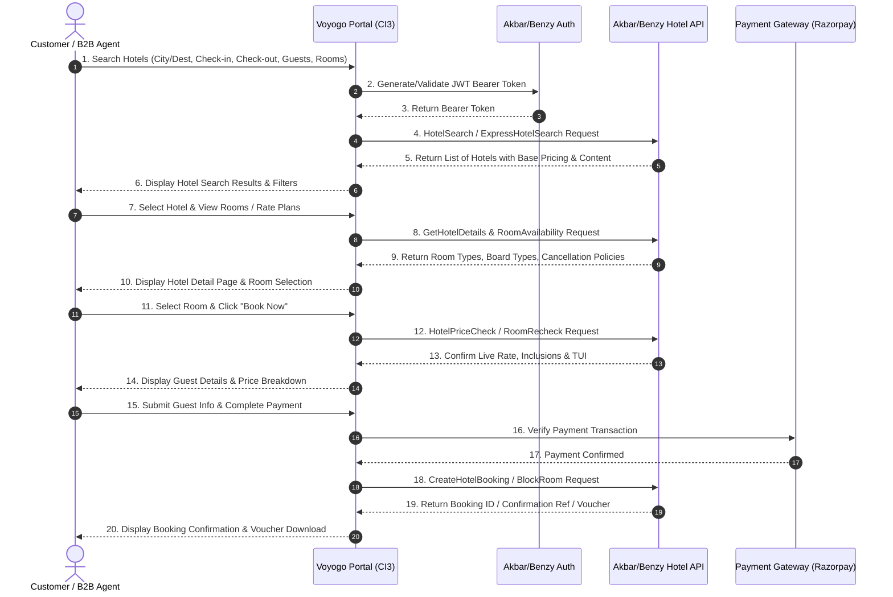

# Akbar / Benzy B2B Hotel API Integration Specification

This document provides the integration structure, endpoints, workflows, and payload requirements for the **Akbar / Benzy B2B Hotel API** on the Voyogo platform.

---

## 1. Overview & Architecture

* **Portal**: Web Connect Resource Center (WRC) - Hotels
* **Documentation URL**: `https://wrc.benzyinfotech.com/hotels/`
* **Authentication**: JWT Bearer Token generated via `/Utils/Signature` or Hotel-specific auth endpoint.
* **Environment Base URLs**:
  * **Test/Sandbox**: `https://wrc.benzyinfotech.com/hotels/` / `https://staging-api.benzyinfotech.com/`
  * **Production**: `https://apiagents.akbartravelsonline.com/` / `https://apiutilsagents.akbartravelsonline.com/`

---

## 2. Standard Hotel Booking Workflow

Mermaid workflow diagram showing the end-to-end hotel search, room selection, repricing, passenger details, booking block, and payment:



---

## 3. Key API Endpoints & Request/Response Contracts

### 3.1 Authentication (`/Utils/Signature`)
* **Method**: `POST`
* **Request Payload**:
  ```json
  {
    "MerchantID": "{MERCHANT_ID}",
    "ApiKey": "{API_KEY}",
    "ClientID": "{CLIENT_ID}",
    "Password": "{PASSWORD}",
    "AgentCode": "{AGENT_CODE}",
    "BrowserKey": "{BROWSER_KEY}"
  }
  ```
* **Response**:
  ```json
  {
    "Token": "eyJhbGciOiJIUzI1NiIsInR5cCI6IkpXVCJ9...",
    "Status": 200,
    "Message": "Success"
  }
  ```

---

### 3.2 Hotel Search (`/Hotels/Search` or `ExpressHotelSearch`)
* **Method**: `POST`
* **Headers**: `Authorization: Bearer {TOKEN}`, `Content-Type: application/json`
* **Request Payload**:
  ```json
  {
    "Destination": "Goa",
    "CityCode": "GOI",
    "CountryCode": "IN",
    "CheckInDate": "2026-09-15",
    "CheckOutDate": "2026-09-18",
    "Rooms": [
      {
        "Adults": 2,
        "Children": 0,
        "ChildAges": []
      }
    ],
    "Nationality": "IN",
    "Currency": "INR",
    "StarRating": [3, 4, 5]
  }
  ```
* **Response Sample**:
  ```json
  {
    "SearchId": "HTL_SRCH_8923490",
    "TotalCount": 45,
    "Hotels": [
      {
        "HotelCode": "HTL_GOA_001",
        "HotelName": "Taj Exotica Resort & Spa",
        "StarRating": 5,
        "Address": "Benaulim Beach, South Goa",
        "Latitude": "15.2638",
        "Longitude": "73.9234",
        "Thumbnail": "https://images.unsplash.com/photo-1566073771259-6a8506099945",
        "MinRate": 14500.00,
        "Currency": "INR",
        "Amenities": ["Pool", "Free WiFi", "Spa", "Beach Access", "Restaurant"]
      }
    ]
  }
  ```

---

### 3.3 Hotel Room Availability & Rates (`/Hotels/Details`)
* **Method**: `POST`
* **Request Payload**:
  ```json
  {
    "SearchId": "HTL_SRCH_8923490",
    "HotelCode": "HTL_GOA_001"
  }
  ```
* **Response Sample**:
  ```json
  {
    "HotelCode": "HTL_GOA_001",
    "HotelName": "Taj Exotica Resort & Spa",
    "Rooms": [
      {
        "RoomId": "RM_DLX_01",
        "RoomName": "Deluxe Garden View Room",
        "BoardType": "Breakfast Included",
        "Price": 14500.00,
        "Taxes": 2610.00,
        "TotalPrice": 17110.00,
        "Refundable": true,
        "CancellationDeadline": "2026-09-12 23:59:59",
        "CancellationPolicy": "Free cancellation before 12 Sep 2026. 100% charges apply after."
      },
      {
        "RoomId": "RM_SUT_02",
        "RoomName": "Premium Sea View Suite",
        "BoardType": "Breakfast & Dinner Included",
        "Price": 18000.00,
        "Taxes": 3240.00,
        "TotalPrice": 21240.00,
        "Refundable": true,
        "CancellationDeadline": "2026-09-10 23:59:59",
        "CancellationPolicy": "Free cancellation before 10 Sep 2026."
      }
    ]
  }
  ```

---

### 3.4 Rate Recheck / Reprice (`/Hotels/PriceCheck`)
* **Method**: `POST`
* **Request Payload**:
  ```json
  {
    "SearchId": "HTL_SRCH_8923490",
    "HotelCode": "HTL_GOA_001",
    "RoomId": "RM_DLX_01"
  }
  ```
* **Response**: Confirms price stability, room inventory block token, and final price.

---

### 3.5 Create Hotel Itinerary & Booking (`/Hotels/Book`)
* **Method**: `POST`
* **Request Payload**:
  ```json
  {
    "BookingToken": "BKG_TKN_982347",
    "HotelCode": "HTL_GOA_001",
    "RoomId": "RM_DLX_01",
    "LeadGuest": {
      "Title": "Mr",
      "FirstName": "John",
      "LastName": "Doe",
      "Email": "john.doe@example.com",
      "Phone": "+919876543210"
    },
    "Guests": [
      { "Title": "Mr", "FirstName": "John", "LastName": "Doe", "Type": "Adult" },
      { "Title": "Mrs", "FirstName": "Jane", "LastName": "Doe", "Type": "Adult" }
    ],
    "SpecialRequests": "Non-smoking room, high floor"
  }
  ```
* **Response**:
  ```json
  {
    "Status": "Confirmed",
    "BookingReference": "VOY-HTL-20260905-1829",
    "SupplierReference": "AKB-HTL-8912349",
    "HotelConfirmationNumber": "HTL-CONF-77281",
    "BookingAmount": 17110.00,
    "VoucherUrl": "https://voyogo.com/hotels/voucher/VOY-HTL-20260905-1829"
  }
  ```

---

## 4. Error Codes & Handling

| Error Code | Meaning | Remediation |
| :--- | :--- | :--- |
| `401 / 403` | Unauthorized / IP Not Whitelisted | Ensure IP is whitelisted on Akbar hotel firewall and JWT is valid |
| `1001` | Destination / City Not Found | Use standard IATA / Benzy City Codes |
| `2001` | Room Sold Out / Price Changed | Prompt customer to reselect room rate |
| `3001` | Credit Limit Exceeded | Deposit top-up required on Akbar B2B agency account |
